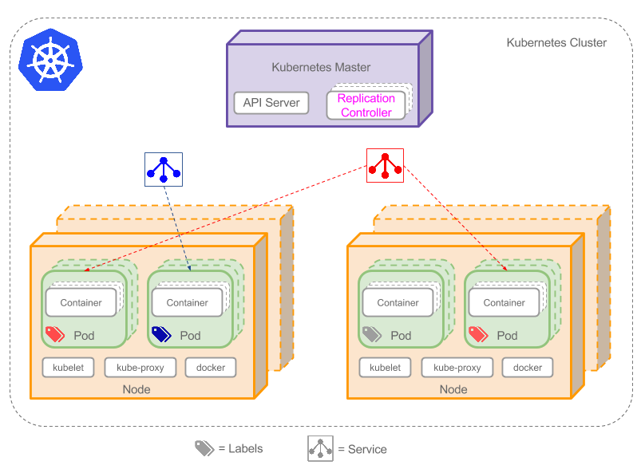

# Label

Label是附着到object上（例如Pod）的键值对。可以在创建object的时候指定，也可以在object创建后随时指定。Labels的值对系统本身并没有什么含义，只是对用户才有意义。

```json
"labels": {
  "key1" : "value1",
  "key2" : "value2"
}
```

Kubernetes最终将对labels最终索引和反向索引用来优化查询和watch，在UI和命令行中会对它们排序。不要在label中使用大型、非标识的结构化数据，记录这样的数据应该用annotation。

## 动机

Label能够将组织架构映射到系统架构上（就像是康威定律），这样能够更便于微服务的管理，你可以给object打上如下类型的label：

- `"release" : "stable"`, `"release" : "canary"`
- `"environment" : "dev"`, `"environment" : "qa"`, `"environment" : "production"`
- `"tier" : "frontend"`, `"tier" : "backend"`, `"tier" : "cache"`
- `"partition" : "customerA"`, `"partition" : "customerB"`
- `"track" : "daily"`, `"track" : "weekly"`
- `"team" : "teamA"`,`"team:" : "teamB"`

## 语法和字符集

Label key的组成：

- 不得超过63个字符
- 可以使用前缀，使用/分隔，前缀必须是DNS子域，不得超过253个字符，系统中的自动化组件创建的label必须指定前缀，`kubernetes.io/`由kubernetes保留
- 起始必须是字母（大小写都可以）或数字，中间可以有连字符、下划线和点

Label value的组成：

- 不得超过63个字符
- 起始必须是字母（大小写都可以）或数字，中间可以有连字符、下划线和点

## Label selector

Label不是唯一的，很多object可能有相同的label。

通过label selector，客户端／用户可以指定一个object集合，通过label selector对object的集合进行操作。

Label  selector有两种类型：

- *equality-based*  ：可以使用`=`、`==`、`!=`操作符，可以使用逗号分隔多个表达式
- *set-based* ：可以使用`in`、`notin`、`!`操作符，另外还可以没有操作符，直接写出某个label的key，表示过滤有某个key的object而不管该key的value是何值，`!`表示没有该label的object

## 示例

```bash
$ kubectl get pods -l environment=production,tier=frontend
$ kubectl get pods -l 'environment in (production),tier in (frontend)'
$ kubectl get pods -l 'environment in (production, qa)'
$ kubectl get pods -l 'environment,environment notin (frontend)'
```

## 在API object中设置label selector

在`service`、`replicationcontroller`等object中有对pod的label selector，使用方法只能使用等于操作，例如：

```yaml
selector:
    component: redis
```

在`Job`、`Deployment`、`ReplicaSet`和`DaemonSet`这些object中，支持*set-based*的过滤，例如：

```yaml
selector:
  matchLabels:
    component: redis
  matchExpressions:
    - {key: tier, operator: In, values: [cache]}
    - {key: environment, operator: NotIn, values: [dev]}
```

如Service通过label selector将同一类型的pod作为一个服务expose出来。



另外在node affinity和pod affinity中的label selector的语法又有些许不同，示例如下：

```yaml
  affinity:
    nodeAffinity:
      requiredDuringSchedulingIgnoredDuringExecution:
        nodeSelectorTerms:
        - matchExpressions:
          - key: kubernetes.io/e2e-az-name
            operator: In
            values:
            - e2e-az1
            - e2e-az2
      preferredDuringSchedulingIgnoredDuringExecution:
      - weight: 1
        preference:
          matchExpressions:
          - key: another-node-label-key
            operator: In
            values:
            - another-node-label-value
```

详见[node selection](https://github.com/kubernetes/kubernetes.github.io/tree/master/docs/user-guide/node-selection)。