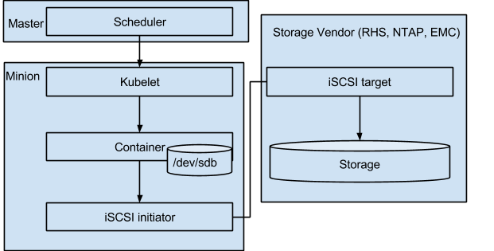

# 使用OpenEBS做持久化存储

本文将指导您如何在Kubernetes集群上安装[OpenEBS](https://github.com/openebs/openebs)作为持久化存储。

我们将使用[Operator](https://coreos.com/operators/)的方式来安装OpenEBS，安装之前需要先确认您的节点上已经安装了iSCSI。

## 先决条件

OpenEBS依赖与iSCSI做存储管理，因此需要先确保您的集群上已有安装openiscsi。

**注意**：如果您使用kubeadm，容器方式安装的kublet，那么其中会自带iSCSI，不需要再手动安装，如果是直接使用二进制形式在裸机上安装的kubelet，则需要自己安装iSCSI。

iSCSI( Internet Small Computer System Interface 互联网小型计算机系统接口)是一种基于TCP/IP 的协议，用来建立和管理IP存储设备、主机和客户机等之间的相互连接，并创建存储区域网络（SAN）。SAN 使得SCSI 协议应用于高速数据传输网络成为可能，这种传输以数据块级别（block-level）在多个数据存储网络间进行。SCSI 结构基于C/S模式，其通常应用环境是：设备互相靠近，并且这些设备由SCSI 总线连接。

OpenEBS需要使用iSCSI作为存储协议，而CentOS上默认是没有安装该软件的，因此我们需要手动安装。

iSCSI中包括两种类型的角色：

- **target**：用来提供存储（server）
- **initiator**：使用存储的客户端（client）

下图在Kubernetes中使用iSCSI的架构图（图片来源：http://rootfs.github.io/iSCSI-Kubernetes/）。



安装iSCSI服务十分简单，不需要额外的配置，只要安装后启动服务即可。

在每个node节点上执行下面的命令：

```bash
yum -y install iscsi-initiator-utils
systemctl enable iscsid
systemctl start iscsid
```

## 快速开始

使用Operator运行OpenEBS服务：

```bash
wget https://raw.githubusercontent.com/openebs/openebs/master/k8s/openebs-operator.yaml
kubectl apply -f openebs-operator.yaml
```

使用默认或自定义的storageclass：

```bash
wget https://raw.githubusercontent.com/openebs/openebs/master/k8s/openebs-storageclasses.yaml
kubectl apply -f openebs-storageclasses.yaml
```

用到的镜像有：

- openebs/m-apiserver:0.5.1-RC1
- openebs/openebs-k8s-provisioner:0.5.1-RC2
- openebs/jiva:0.5.1-RC1
- openebs/m-exporter:0.5.0

## 测试

下面使用OpenEBS官方文档中的[示例]()，安装Jenkins测试

```bash
wget https://raw.githubusercontent.com/openebs/openebs/master/k8s/demo/jenkins/jenkins.yml
kubectl apply -f jenkins.yml
```

查看PV和PVC

```bash
$ kubectl get pv
NAME                                       CAPACITY   ACCESS MODES   RECLAIM POLICY   STATUS    CLAIM                     STORAGECLASS       REASON    AGE
pvc-8e203e86-f1e5-11e7-aa47-f4e9d49f8ed0   5G         RWO            Delete           Bound     default/jenkins-claim     openebs-standard             1h

$ kubectl get pvc
kubectl get pvc
NAME              STATUS    VOLUME                                     CAPACITY   ACCESS MODES   STORAGECLASS       AGE
jenkins-claim     Bound     pvc-8e203e86-f1e5-11e7-aa47-f4e9d49f8ed0   5G         RWO            openebs-standard   1h
```

查看Jenkins pod

```bash
Events:
  Type     Reason                 Age                From                   Message
  ----     ------                 ----               ----                   -------
  Warning  FailedScheduling       29m (x2 over 29m)  default-scheduler      PersistentVolumeClaim is not bound: "jenkins-claim" (repeated 3 times)
  Normal   Scheduled              29m                default-scheduler      Successfully assigned jenkins-668dfbd847-vhg4c to 172.20.0.115
  Normal   SuccessfulMountVolume  29m                kubelet, 172.20.0.115  MountVolume.SetUp succeeded for volume "default-token-3l9f0"
  Warning  FailedMount            27m                kubelet, 172.20.0.115  Unable to mount volumes for pod "jenkins-668dfbd847-vhg4c_default(8e2ad467-f1e5-11e7-aa47-f4e9d49f8ed0)": timeout expired waiting for volumes to attach/mount for pod "default"/"jenkins-668dfbd847-vhg4c". list of unattached/unmounted volumes=[jenkins-home]
  Warning  FailedSync             27m                kubelet, 172.20.0.115  Error syncing pod
  Normal   SuccessfulMountVolume  26m                kubelet, 172.20.0.115  MountVolume.SetUp succeeded for volume "pvc-8e203e86-f1e5-11e7-aa47-f4e9d49f8ed0"
  Normal   Pulling                26m                kubelet, 172.20.0.115  pulling image "harbor-001.jimmysong.io/library/jenkins:lts"
  Normal   Pulled                 26m                kubelet, 172.20.0.115  Successfully pulled image "harbor-001.jimmysong.io/library/jenkins:lts"
  Normal   Created                26m                kubelet, 172.20.0.115  Created container
  Normal   Started                26m                kubelet, 172.20.0.115  Started container
```

启动成功。Jenkins配置使用的是**NodePort**方式访问，现在访问集群中任何一个节点的Jenkins service的NodePort即可。

## 存储策略

OpenEBS的存储策略使用StorageClaass实现，包括如下的StorageClass：

- openebs-cassandra
- openebs-es-data-sc
- openebs-jupyter
- openebs-kafka
- openebs-mongodb
- openebs-percona
- openebs-redis
- openebs-standalone
- openebs-standard
- openebs-zk

每个[Storage Class](../concepts/storageclass.md)都对应与某种应用的存储模式，使用方式请参考[OpenEBS Storage Policies](http://openebs.readthedocs.io/en/latest/Policies/storage_policy.html)。

## 参考

- [OpenEBS Documentation](http://openebs.readthedocs.io/)
- [CentOS 7.x 下配置iSCSI网络存储](http://blog.csdn.net/wh211212/article/details/52981305)
- [Configure iSCSI Initiator](https://www.server-world.info/en/note?os=CentOS_7&p=iscsi&f=2)
- [RHEL7: Configure a system as either an iSCSI target or initiator that persistently mounts an iSCSI target.](https://www.certdepot.net/rhel7-configure-iscsi-target-initiator-persistently/)
