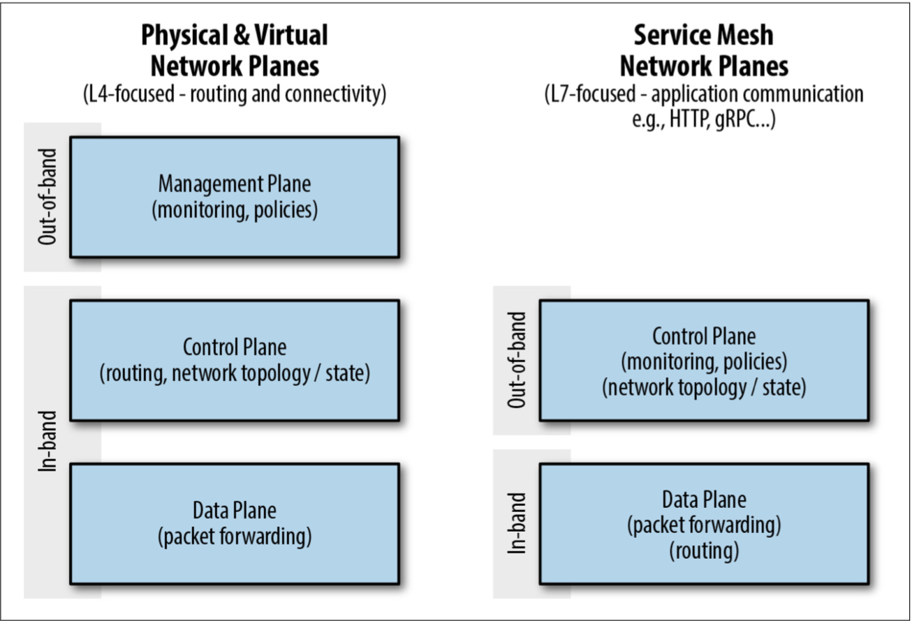
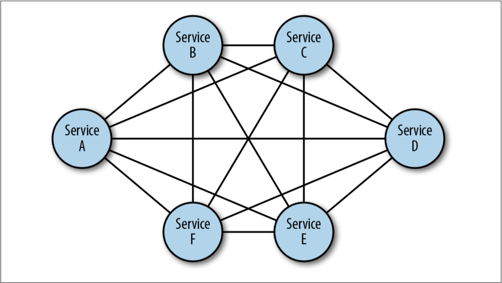
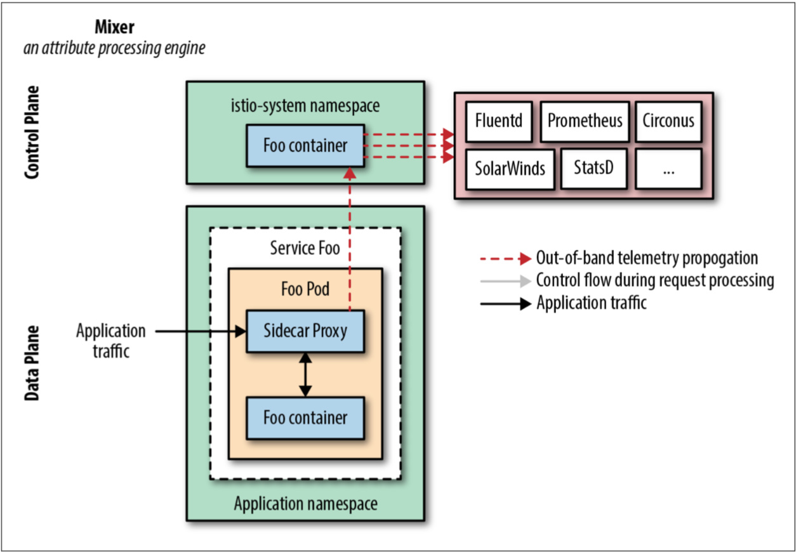
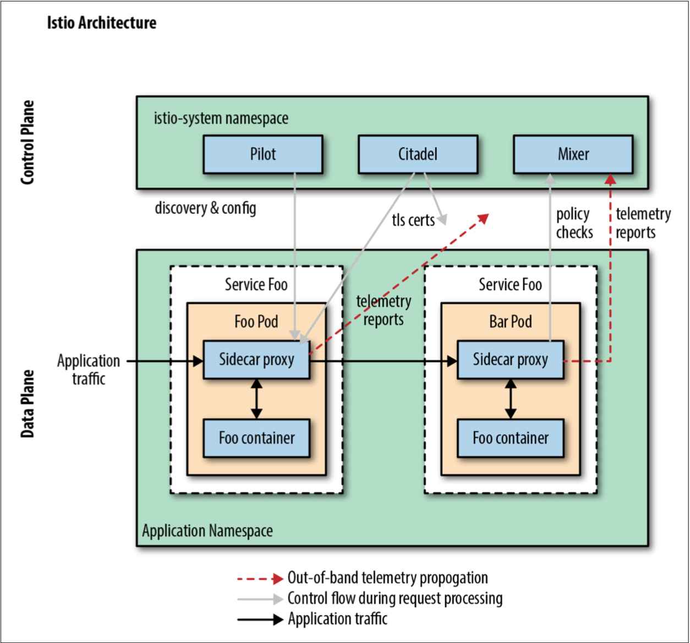
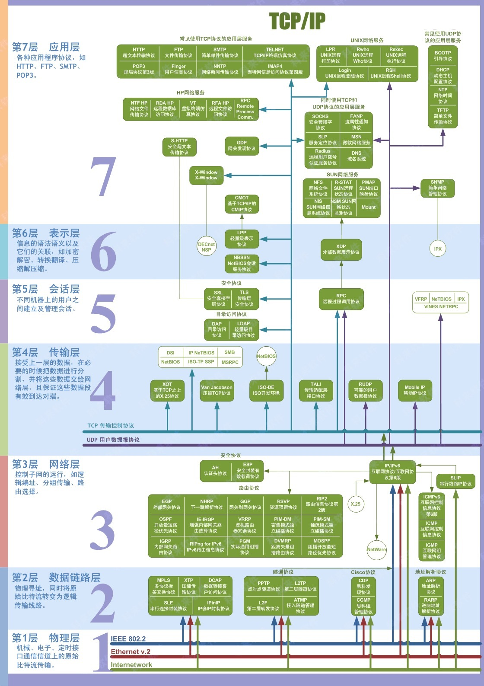
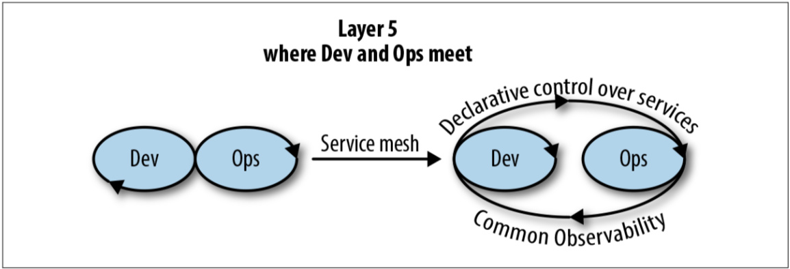

# Service Mesh基础

> 本文是对[The Enterprise Path to Service Mesh Architecutures](https://www.nginx.com/resources/library/the-enterprise-path-to-service-mesh-architectures/)一书的解读。

微服务将原先的单体架构中的应用内通信，转变为基于RPC的远程通信，虽然这样提高了研发效率，提高了开发语言选择的多样性，但是随着单体应用的解体，原先的巨石散落为石块变得四处都是，如何管理这些微服务就成了难题。当微服务的个数少的时候还可以通过人工配置的方式去管理，但随着业务规模的增大，微服务的数量也可能呈指数级增长，如何协调管理成百上千的服务，这就需要有一套设计良好的框架。

一直以来都存在一个[谬误](https://en.wikipedia.org/wiki/Fallacies_of_distributed_computing)，那就是在分布式系统中网络是可靠的。实际上网络是不可靠的，而且也是不安全的，如何保证应用调用和事务的安全性与可靠性，保护微服务的一个专门的基础设施层Service Mesh就应运而生。

Service Mesh是建立在物理或者虚拟网络层之上的，基于策略的微服务的流量控制，与一般的网络协议不同的是它有以下几个特点：

- 开发者驱动
- 可配置策略
- 服务优先的网络配置而不是协议

本章主要介绍Service Mesh的定义和组成，为什么要使用Service Mesh，它可以带来哪些好处。

Service Mesh与传统网络的区别就是**硬件或者虚拟网络**与**软件定义网络（SDN）**的区别，我们从上图中可以看到物理和虚拟网络中比起SDN还多了**管理平面**。

硬件网络中控制平面与数据平面紧耦合，也就是说是与供应商绑定的，管理平面是独立出来的。而SDN却给了我们很多自由度，可以通过软件的形式自定义网络，例如Kubernetes中的[CNI](https://jimmysong.io/kubernetes-handbook/concepts/cni.html)。

物理网络有很多种拓扑类型，如星形拓扑、总线拓扑、环形拓扑、树型拓扑、网状拓扑等，大家可以去搜索拓扑网络。不论是那种拓扑结构，总有一条路径可以从一个节点路由到另一个节点，只是不同的拓扑类型效率不同，管理的复杂度不一样罢了。

下图是网状拓扑，所谓网状拓扑就是每个节点都可以跟所有其他节点直接互联，这样而这也是链接数最多一种拓扑，如果有n个节点的话，链接数就是n(n-1)。

### Service Mesh架构

下图是[Conduit](https://condiut.io) Service Mesh（现在已合并到Linkerd2中了）的架构图，这是Service Mesh的一种典型的架构。

Service Mesh中分为**控制平面**和**数据平面**，当前流行的两款开源的Service Mesh Istio和Linkerd实际上都是这种构造，只不过Istio的划分更清晰，而且部署更零散，很多组件都被拆分，控制平面中包括Mixer、Pilot、Citadel，数据平面默认是用Envoy；而Linkerd中只分为linkerd做数据平面，namerd作为控制平面。

**控制平面**

控制平面的特点：

- 不直接解析数据包
- 与控制平面中的代理通信，下发策略和配置
- 负责网络行为的可视化
- 通常提供API或者命令行工具可用于配置版本化管理，便于持续集成和部署

**数据平面**

数据平面的特点：

- 通常是按照无状态目标设计的，但实际上为了提高流量转发性能，需要缓存一些数据，因此无状态也是有争议的
- 直接处理入站和出站数据包，转发、路由、健康检查、负载均衡、认证、鉴权、产生监控数据等
- 对应用来说透明，即可以做到无感知部署

### Service Mesh的价值所在

Service Mesh中服务是一等公民，它提供L5的网络流量管理，并提供以下功能：

**可观察性**

还是拿Istio做例子，Mixer通过适配器将应用的遥测数据发送给后端监控、日志、认证和份额管理系统。

从上图可以看到Mixer适配器可以对接多种监控和日志后端。

**流量控制**

文中给出的例子是超时、重试、截止时间和速率限制。

**安全性**

下图是Istio中安全通信路径的示意图。

一般的安全性都是通过证书的方式实现的。Sidecar代理负责证书生命周期的管理，包括证书的生成、分发、刷新和注销。从图中还可以看到，在Pod内部sidecar会与应用容器之间建立本地TCP连接，其中使用mTLS（双向传输层加密）。这一点是非常重要的，因为一个节点上甚至一个Pod内都不一定运行一个容器，容器可能会被暴露到外部访问，保证传输层的双向加密，可以保证流量传输的安全。

**延迟和故障注入**

这个功能对于荣宰容灾和故障演练特别有用。通过人为的向系统中注入故障，如HTTP 500错误，通过分析分布式应用的行为，检验系统的健壮性。

### 在L5解耦

这是本书最有重要的一个观点，重要到要放到副标题，熟悉OSI模型的人都知道L5是什么。

*OSI模型（图片来自[CSDN](https://blog.csdn.net/yaopeng_2005/article/details/7064869)）*

Service Mesh是在开发和运维之间植入的一个基础设施层。它将服务通信的关注点分离出来，在TCP/IP层之上抽象出一层通用功能。Service Mesh的引入直接导致生产关系的改变进而提高生产效率。具体表现在：

- **运维人员**在修改服务重试超时时间之前无需再知会**开发人员**。
- **客户成功**部门在撤销客户的访问权限前无需再知会**运维**。
- **产品Owner**可以针对特定服务，根据用户选择的套餐执行配额管理。
- **开发人员**可随时将新版本功能重定向到beta版本，不需要**运维人员**干涉。

这种职责的解耦大大加速了软件的迭代速度，总之你可以把Service Mesh作为OSI模型中的会话层。
